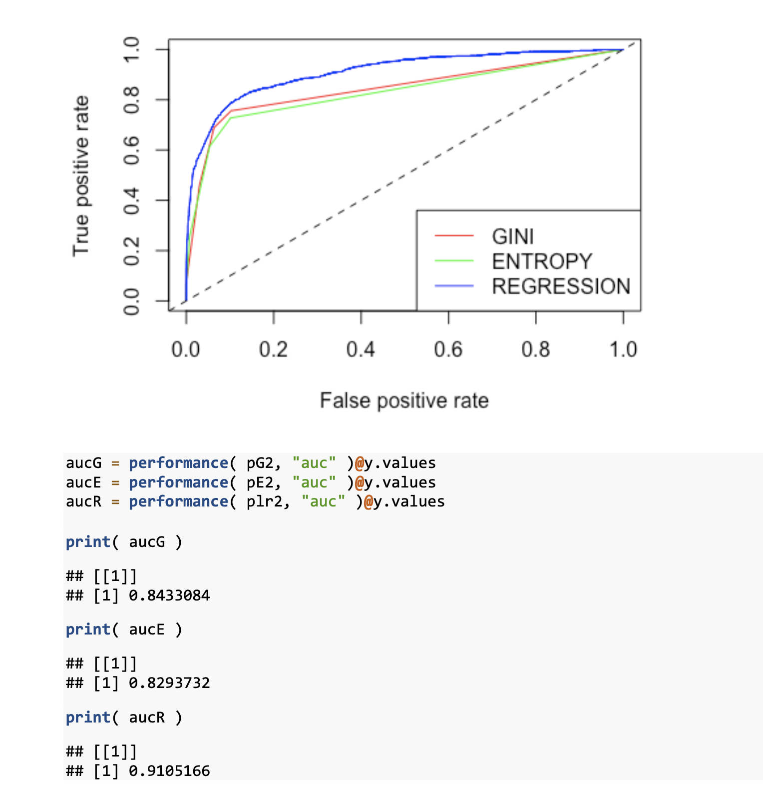
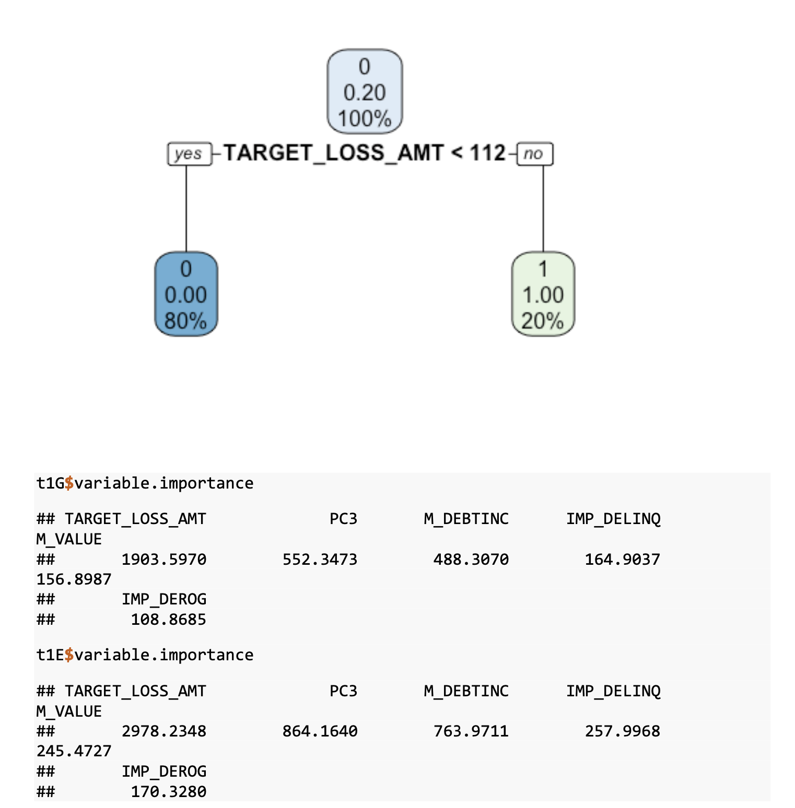
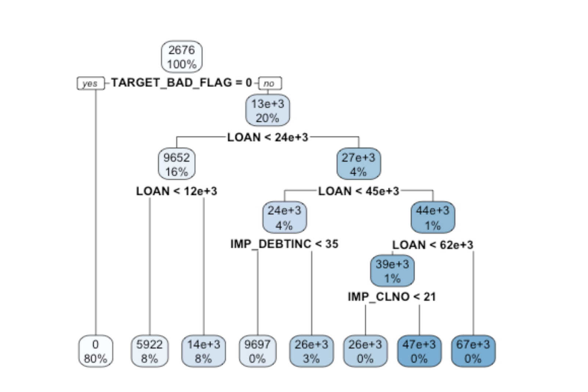
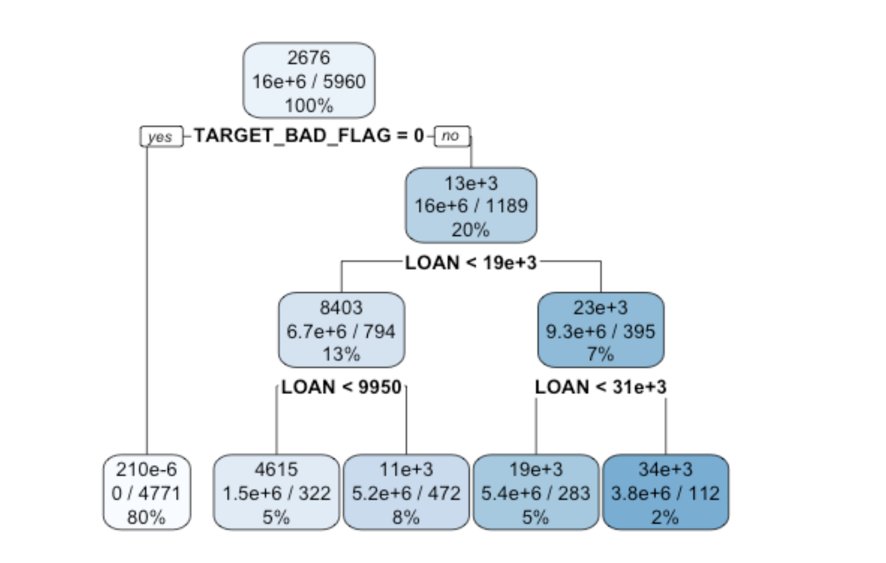
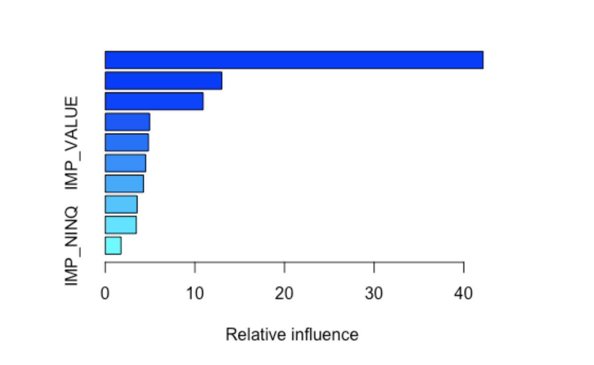
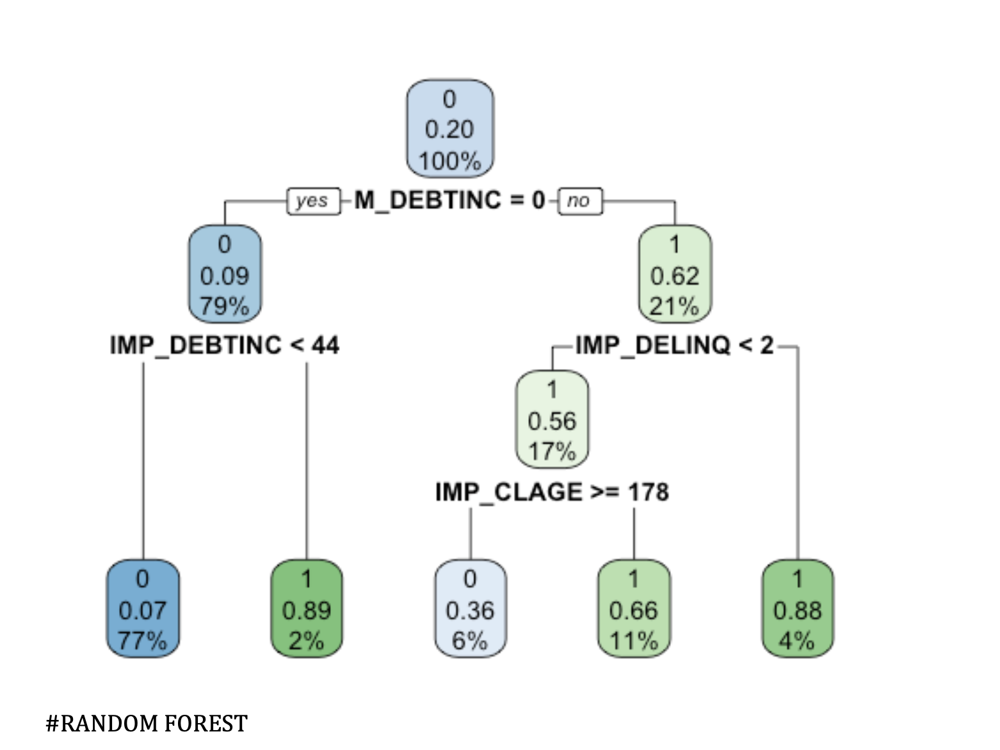
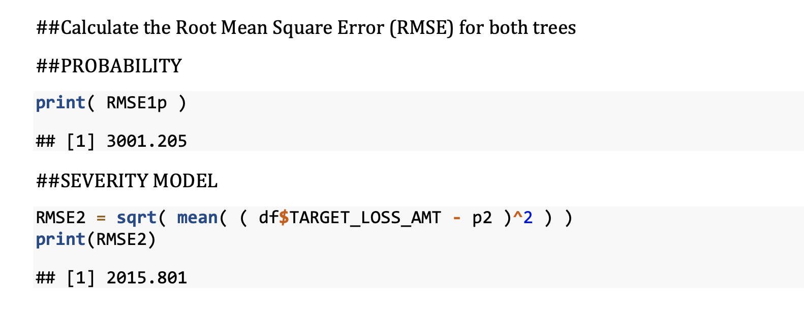

# HMEQ Loan Default & Loss Amount Prediction (Tree + Regression)

This project uses decision trees, ensemble methods, and regression to analyze customer loan default probability and potential financial loss. Dimensionality reduction techniques (PCA & t-SNE) are also applied to observe changes in model performance.

---

## Key Results Summary

To evaluate the impact of dimensionality reduction on model performance, PCA and t-SNE were applied before retraining tree-based and regression models.

| Model Type | AUC (Original Data) | AUC (PCA/t-SNE Data) |
|------------|---------------------|----------------------|
| GINI       | 0.8433              | 0.8289               |
| ENTROPY    | 0.8294              | 0.8383               |
| REGRESSION | 0.9105              | 0.9124               |

### Key Observations

- 🔻 **GINI**: Performance slightly decreased, suggesting PCA/t-SNE may have obscured decision boundaries critical to this criterion.  
- 🔺 **ENTROPY**: Performance improved, possibly due to enhanced separability in high-entropy regions.  
- ➖ **REGRESSION**: Remained stable, indicating that **linear patterns were preserved** even after dimensionality reduction.

### Conclusion

While PCA/t-SNE can remove noise from irrelevant variables, its effect varies by model type:  
- Tree-based models (GINI, ENTROPY) showed **different sensitivities** to the transformed input space.  
- Regression performance was **robust**, reinforcing that principal variance directions remained aligned with the original data.  
- Overall, **dimensionality reduction helped interpretability** but **did not significantly improve predictive power** in this context.

---

## Modeling Workflow

### 1. Tree & Regression on Original Data

- Trained using GINI, ENTROPY, and Regression split criteria.
- Evaluated using AUC on ROC Curve.

ROC Curve:

**Conclusion**:
- Regression split yielded the **highest AUC (0.91)**.
- Tree-based splits also performed well.

---

### 2. Tree & Regression on PCA/t-SNE Transformed Data

- Applied PCA and t-SNE to reduce dimensionality.
- Re-trained the same models on the transformed dataset.

📈 ROC Curve:

**Key Observations**:
- GINI AUC **decreased** slightly → PCA/tSNE obscured some tree-based separability.
- ENTROPY AUC **increased** → Transformation helped clarify some entropy-based splits.
- REGRESSION AUC remained stable → linear structure preserved.

---

### 3. Visual Tree Models

- Tree split using loan amount, debt-to-income ratio, delinquency history, and more.

Anova Regression Tree:

Poisson Regression Tree:

 Gradient Boosting Tree:

 Random Forest Tree:

---

### 4. RMSE Comparison – Probability vs. Severity Models

Calculated RMSE for default probability prediction (`RMSE1p`) and loss amount estimation (`RMSE2`).

RMSE Comparison:

| Model              | RMSE         |
|-------------------|--------------|
| Probability Model | 3001.205     |
| Severity Model    | 2015.801     |

---

### 5. Variable Importance

Feature importance by model:

- Top predictors: `M_VALUE`, `IMP_VALUE`, `IMP_NINQ`, `IMP_DEBTINC`
- 
---
## Tools & Libraries

- Language: **R**
- Packages: `rpart`, `randomForest`, `gbm`, `ROCR`, `MASS`, `tsne`, `caret`
- Methods: Decision Tree, Random Forest, Gradient Boosting, Logistic Regression, PCA, t-SNE

---

